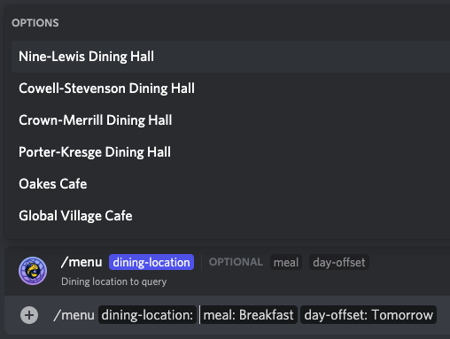
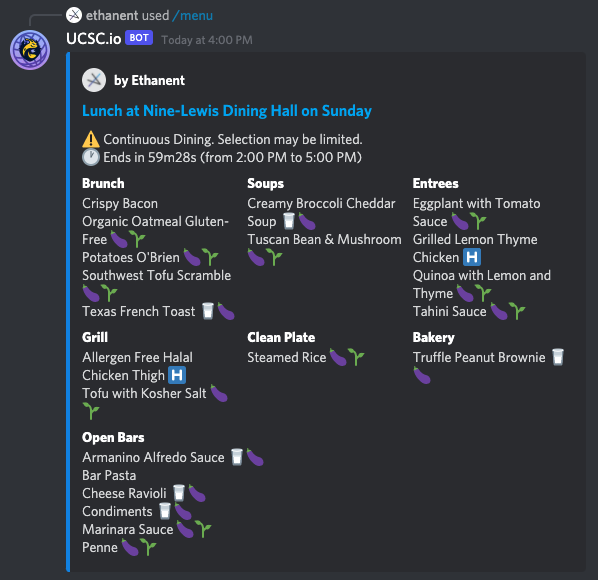
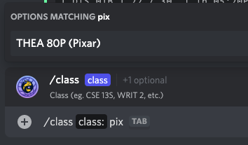
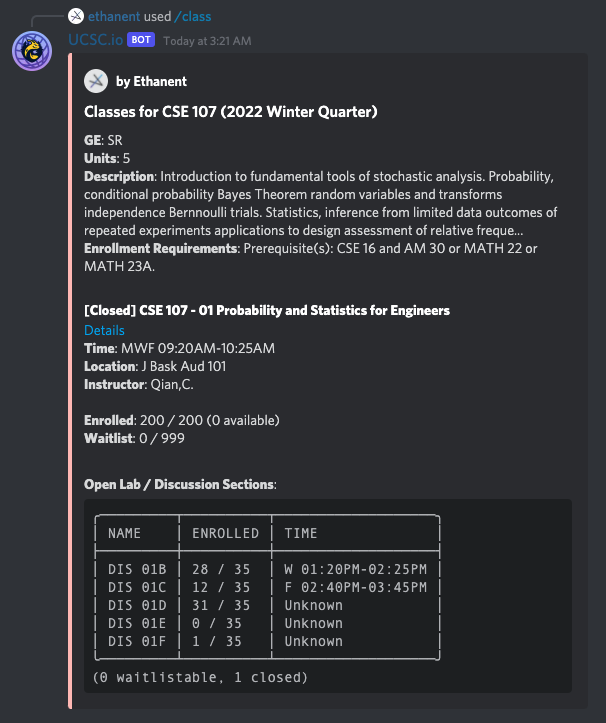
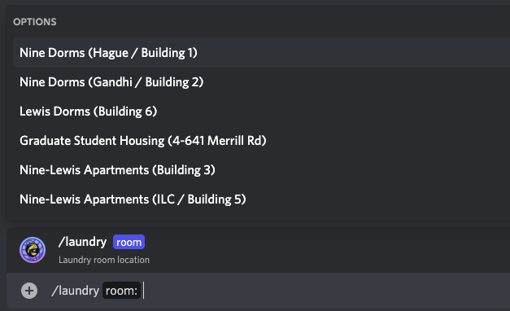
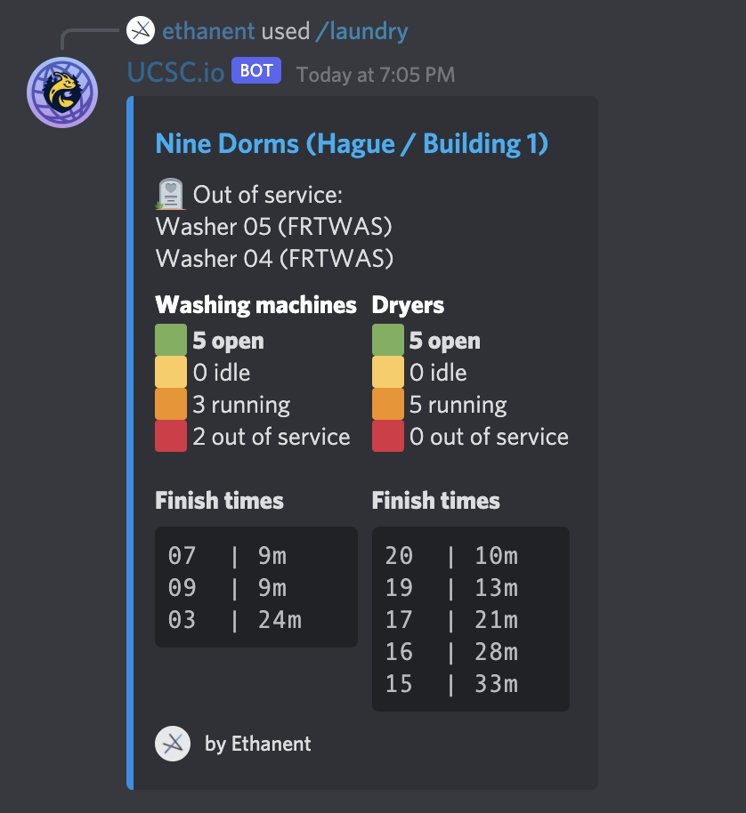

  

# UCSC.io
> Discord bot providing tools and data for UC Santa Cruz students

Add bot: [Click here](https://discord.com/api/oauth2/authorize?client_id=904152967400288296&permissions=274877909056&scope=bot%20applications.commands)

This invite link grants send messages, send messages in threads, and add reactions permissions, thus minimizing the amount of data sent to the bot!

The bot cannot read messages in your server using these permissions, but it will still receive slash command uses so it functions as expected.

## Bot features

### Menu query (`/menu`)

UCSC.io queries dining menus across campus, including future meals using an option.

### Class search (`/class`)

The bot searches and queries status of classes and discussion sections, with built in command autocomplete!

It allows users to search past quarters with the `term` option.

### Laundry room status (`/laundry`)

Using the `/laundry` command, users can easily check on the status of connected laundry rooms on campus.

No more walking to the laundry room just to find no machines are available.

